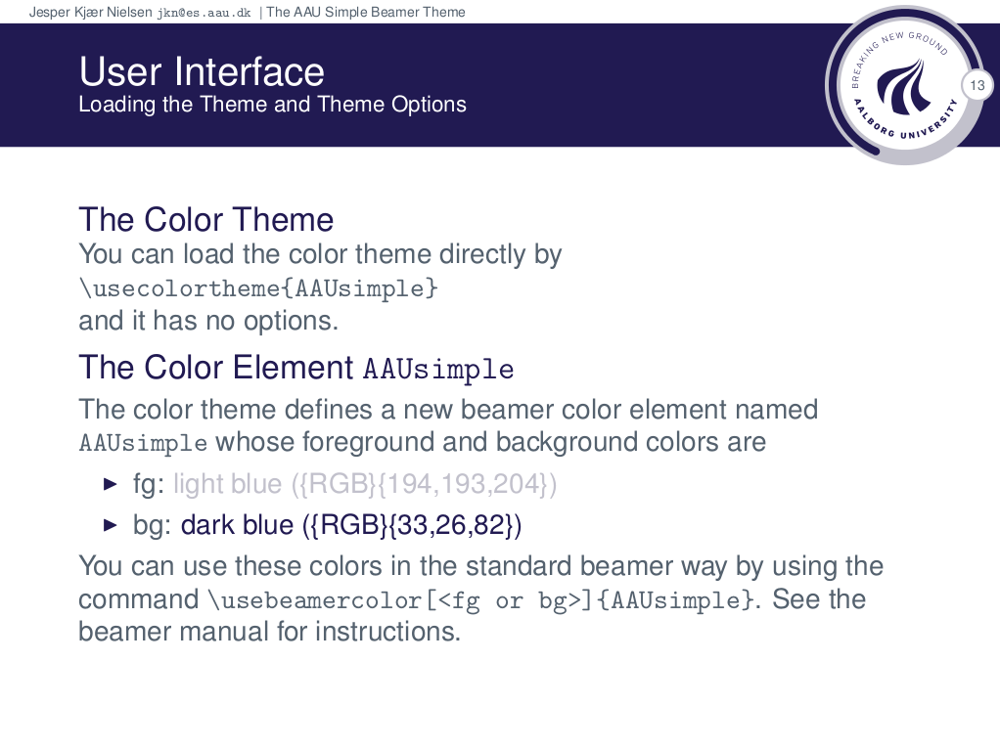
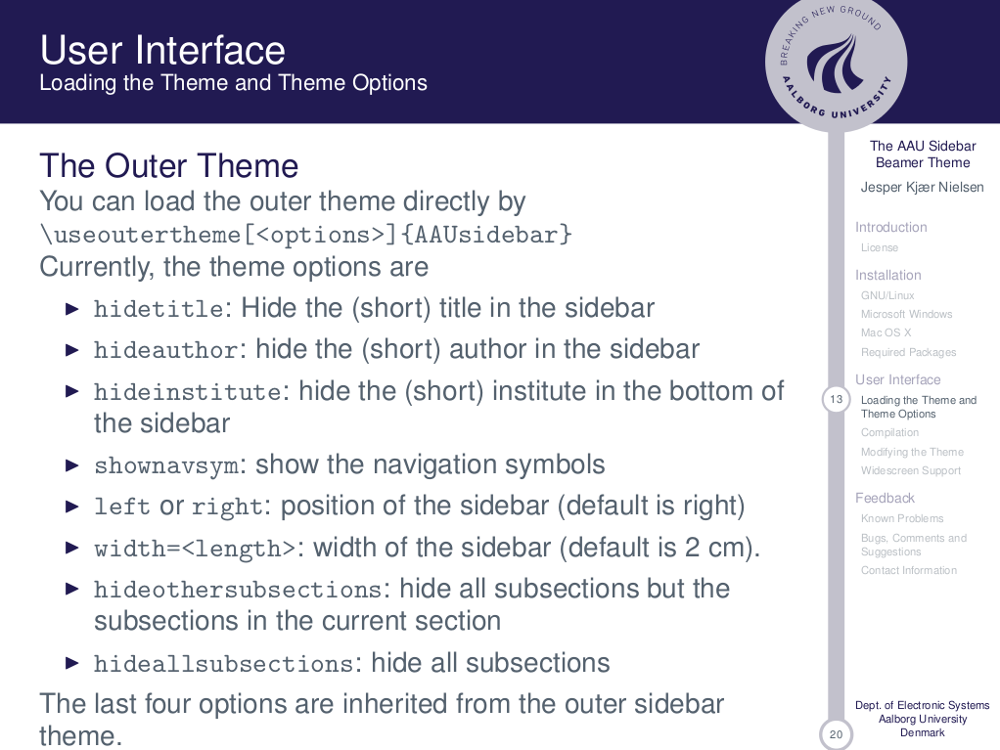
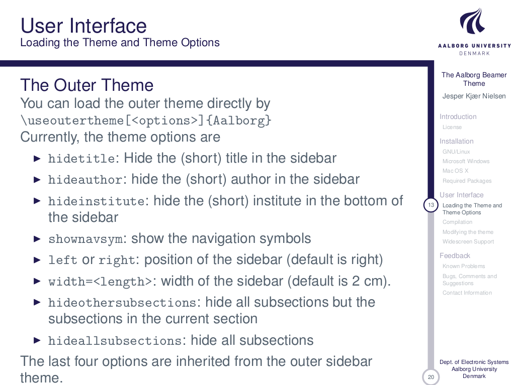
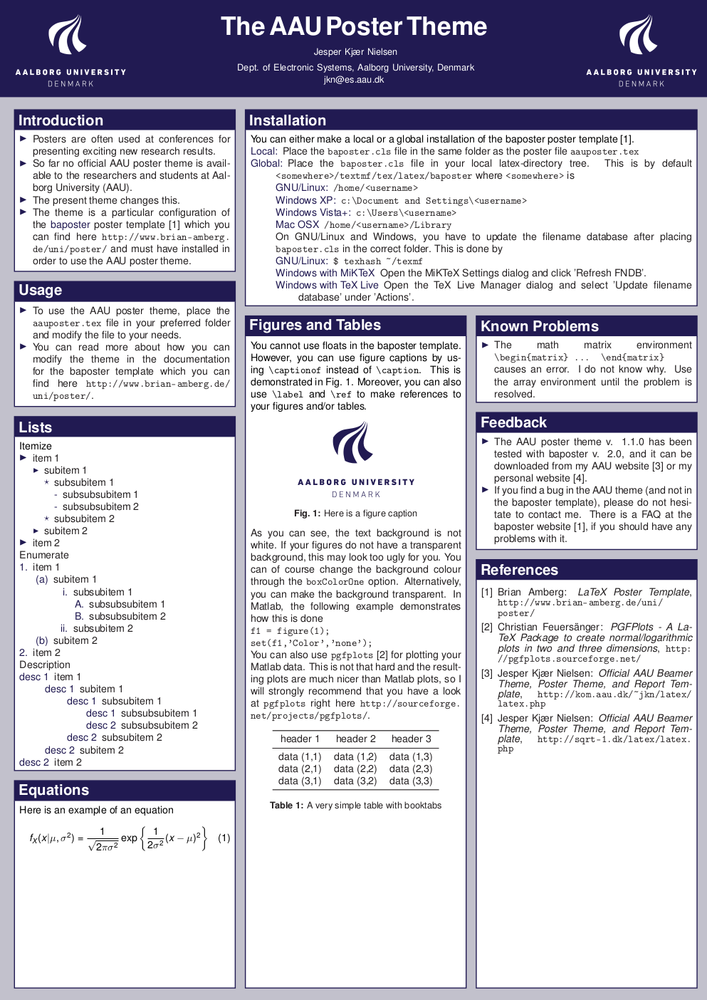

# aauLatexTemplates
On this page, I have collected various Latex-related templates which may be useful to you. The site contains a work/project diary template, three beamer templates, a report template, a Ph.D.-thesis template, and a poster template which are all described in more detail below. These are primarily intended for use by other people studying or working at Aalborg University (AAU), but everyone is encouraged to use the templates.

## The Work and Project Diary
 How often have you returned to an old task wondering what you were thinking the last time you worked on it? Did I really write this piece of code? How did I connect the DUT to the measurement equipment? What did I search for in Google when I found that interesting paper? What did I name that file? Where did I place that piece of paper with the magnificent derivation? Unfortunately, I am guilty of asking myself these and many other questions way too often. Yes, I tend to forget things. Even important things. Things which I am sure that the future me will remember, but he often disappoints me.

I am also guilty of being a happy LaTeX2e user. And friendly - to myself at least. Therefore, I decided to create the present LaTeX-based work diary to the forgetful future me. The diary resembles a good old lab journal, but it is hopefully also much more powerful while still being fairly simple to use. The focus should be on the work - not on managing a diary - because the current me hates bureaucracy.

Sure sure, that all sounds great and all, but how do you manage the diary in two years from now when it consists of 1000 pages? What about in 10 years? Can you write confidential information in the diary and still share your work with an external partner? Yes, you can! Thanks to a tagging system, the diary can be build conditionally on these tags or on the time.

The work diary can also be used as a collaborative tool for multiple forgetful people working on the same project. When used in this way, the diary is a project diary which serves as the documentation of the project.

## Beamer Themes
A lot of the people at AAU use the beamer class to make their presentations which they give at exams, lectures, conferences, and workshops. These people often use one of the many standard beamer themes for their presentations. There is nothing wrong with these themes, and they serve their purpose. However, they are not very unique and do not promote Aalborg University very well. In order to avoid this, I have created three Beamer themes:

- The AAU Simple Beamer Theme
 
See [an example/the documentation](aauBeamer/aausimple/AAUsimpletheme.pdf).
- The AAU Sidebar Beamer Theme
 
See [an example/the documentation](aauBeamer/aalborg/aausidebar/AAUsidebartheme.pdf).
- The Aalborg Beamer Theme
 
See [an example/the documentation](aauBeamer/aalborg/aalborgtheme.pdf).

If you like these, but are not affiliated with Aalborg University, you are very welcome to modify them. The easiest theme to modify is the Aalborg theme.

## The AAU Report Template
 Many students use LaTeX for typesetting their reports. Although LaTeX is very powerful and able to create beautiful documents, the learning curve for LaTeX novices may be quite steep. Especially the management of the layout may be hard.

This report template is an attempt to give these LaTeX novices a gentle start. The template takes care of loading the most common packages in the preamble, creating a front page, an English and a Danish AAU title page, a preface with signatures, and a simple folder structure for organising the tex-files.

See [an example/the documentation](aauReportTemplate/master.pdf).

## The AAU Ph.D. Thesis Template
 Most Ph.D.-students at Aalborg University write their thesis as a collection of papers. That is, the thesis consists of two parts. The first part contains an introduction to the problem, the state-of-the-art and the contributions made by the Ph.D.-student and his/her co-authors. The second part contains the relevant paper published during the Ph.D.

This template can be used for writing such a thesis. The template takes care of loading the most common packages in the preamble, creating a front page, an English and a Danish abstract, a preface, the two parts, and a simple folder structure for organising the tex-files. 

See [an example/the documentation](aauPhdCollectionThesis/master.pdf).

## The AAU Poster Theme

 When researchers and students from Aalborg University (AAU) attend conferences around the world, they often use a poster for presenting their newest research results. To the best of my knowledge no AAU-branded poster theme is available to these researchers and students so they have to create their own or modify an existing theme.

In order to avoid this, I have therefore created an AAU poster theme. The theme, which I have named aauposter, is simple, clean and unique. It is a particular configuration of the baposter class, and you have to download the baposter.cls file to use the AAU poster theme.

See [an example/the documentation](aauPoster/aauposter.pdf).
